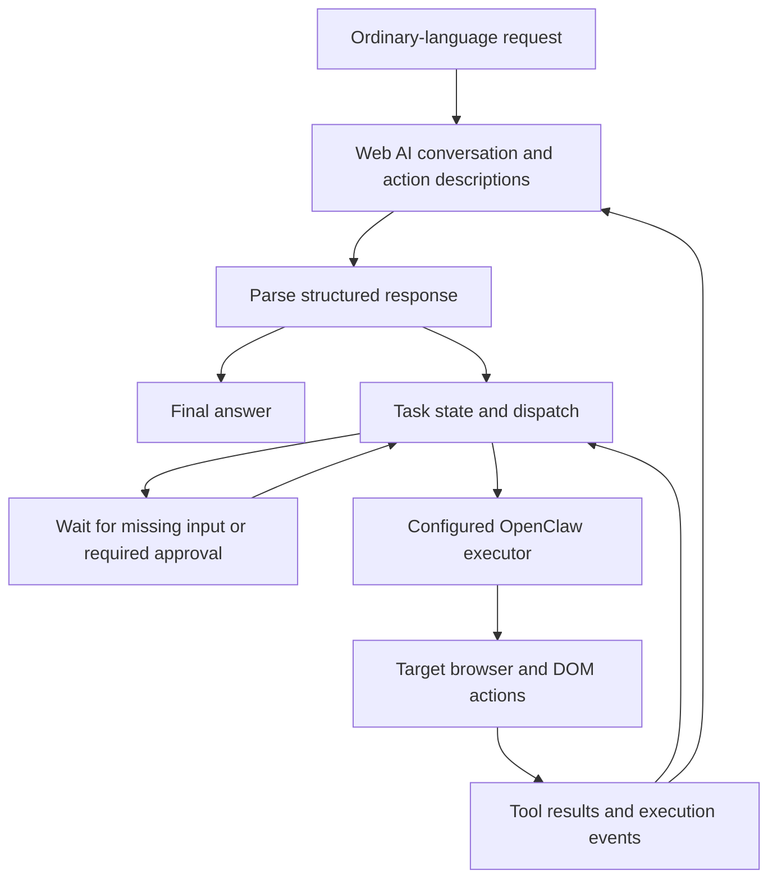
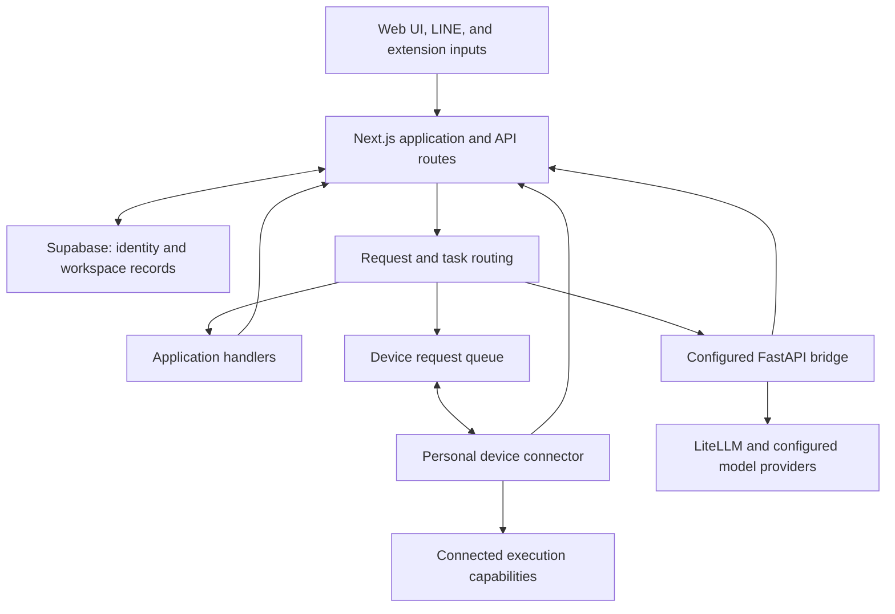
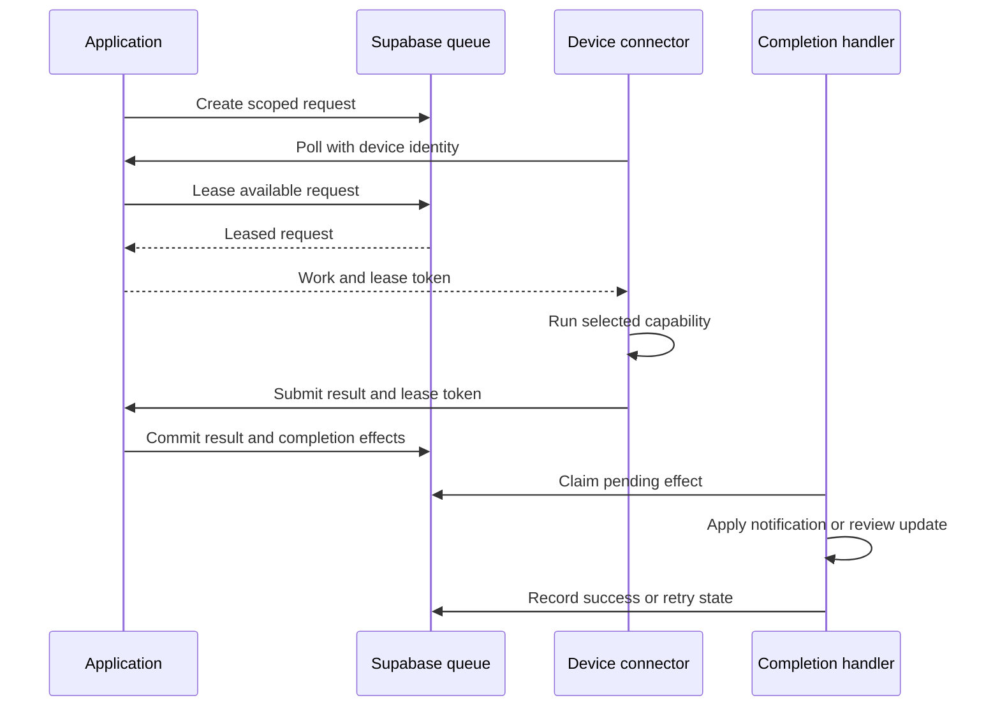

# DanielDoWork — AI Workspace

DanielDoWork turns ordinary-language requests into structured, trackable work. Its central concept connects GPT, Claude, or Gemini web conversations to an execution runtime, with OpenClaw and browser/DOM capabilities carrying out supported actions. Project records and business conversations supply the working context.

**This is my first major software project and my largest investment of personal effort and self-funded development.** My work spans the web application, service integration, personal-compute connection, debugging, and release coordination, using AI coding assistants during development.

[Product website](https://www.danieldowork.com) · [AI infrastructure](https://github.com/yo20ywork-max/danieldowork-ai-showcase) · [Source review map](SOURCE_REVIEW.md) · [Portfolio](https://github.com/yo20ywork-max/research-portfolio)

This public repository contains an architecture walkthrough and a runnable source excerpt. The operational application remains private. The description below follows selected implementation paths in fixed source snapshots; it does not establish that every path is enabled on the public website.

## 1. Core idea: web conversations that drive executable tasks

My central idea is to describe OpenClaw's execution capabilities in natural language, let a conversational AI interpret an ordinary user request against those capabilities, and convert the response into structured work that a runtime can schedule and execute.

The intended planning interface is an existing **ChatGPT, Claude, or Gemini web conversation**. A supported free-tier account can be an entry point where the provider makes it available; the design aims to avoid requiring a model API key for that browser-conversation path. Account limits, sign-in state, provider availability, and execution resources still apply. Other application paths can use configured APIs or local models.

The reasoning interface and the execution interface have different jobs:

- **Planning browser:** carries the conversation with GPT, Claude, or Gemini.
- **Execution browser:** contains the target page whose DOM is inspected or manipulated.
- **Task runtime:** translates structured requests into state transitions and dispatches work to the selected executor.

The AI describes the requested action; the runtime decides whether and how to execute it.



This diagram expresses the product concept. The reviewed code contains the component implementations described below; it does not establish that every drawn path is connected and accepted in a single production deployment.

| Stage | Transformation | Source-backed implementation scope |
|---|---|---|
| Capability description | Executable capabilities become instructions the model can understand | The desktop-worker prompt defines action names, fields, and response grammar |
| Intent interpretation | User language becomes a proposed action or final response | Separate ChatGPT, Claude, and Gemini browser adapters |
| Task decomposition | A broad request becomes actionable steps and expected results | Application task/flow records and a bounded worker loop; the inspected response protocol accepts one tool call at a time |
| Scheduling | Ready work is assigned while state, ownership, and retries are tracked | Queue claims, leases, task events, flow records, and wake-related infrastructure |
| Execution | An accepted structured action is passed to an executor | OpenClaw fake, CLI, or HTTP adapter modes |
| DOM interaction | A browser action targets an actual page element | Separate browser/DOM execution components, including target checks, action primitives, and DOM-stability waits |
| Feedback | Observed results update the task and return to the conversation | Tool-result prompts, task-state updates, events, and completion handling |

The existing worker's tool-result prompt normally asks the model to produce a final answer after receiving the result. A general planner that always produces and executes a complete dependency-aware task checklist is a broader design goal, not a capability established by that prompt alone.

Task progression uses results and state changes. Current work delivery includes HTTP polling and leases; this is not a claim of a completely push-driven event system.

The wider workspace supplies the project data, conversations, access controls, result views, and integration context that make this execution loop useful in everyday work.

## 2. System architecture



The diagram summarizes available paths across the product. An individual request follows the path selected by its endpoint, workspace configuration, permissions, and available runtime. The bridge and personal-device paths are alternatives for some requests; they are not mandatory consecutive steps.

| Layer | Responsibility | Implementation area |
|---|---|---|
| Web experience | Dashboard, projects, editable records, conversations, import screens, settings, and task views | Next.js App Router, React, TypeScript, Tailwind CSS |
| Identity and scope | Resolve the signed-in user, current workspace, owner/member permissions, and plan limits | Supabase Auth, workspace helpers, authorization and quota modules |
| Application data | Persist projects, configurable columns, rows, conversations, task records, and related artifacts | Supabase/PostgreSQL; application schema and migrations |
| Request handling | Validate input, select an assistant or task path, and normalize responses | Next.js API routes and AI/agent modules |
| Personal compute | Register a device, queue requests, lease work, and accept results | Application device-worker routes and connector runtime |
| Companion AI services | Model selection, context assembly, optional verification, browser/agent integration, and a separate worker API | Python/FastAPI infrastructure repository |
| Delivery and operations | Build the web app, manage service/connector versions, apply schema changes, and evaluate release readiness | Separate web, service, device, and database lifecycles |

The reviewed application manifest uses **Next.js 16, React 19, TypeScript, and Tailwind CSS 4**. Older planning documents mention earlier versions and a simpler dual-provider design; the current code contains several distinct execution paths.

## 3. Main operating flows

### A. Project data and spreadsheet import

The dashboard loads the authenticated user's workspace and project records. Projects contain configurable column definitions and row data, allowing different business workflows to share the same table infrastructure.

The spreadsheet flow separates **preview** from **commit**:

1. The preview endpoint checks authentication, workspace access, plan availability, and file constraints.
2. The parser reads sheets and returns a reviewable representation.
3. The commit endpoint validates the selected import, checks project quota, and writes the project, columns, and rows.
4. The workspace can then use those records for display, progress summaries, and contextual assistance.

The public [classification excerpt](examples/classify.ts) is one small part of this larger import system: it selects a template using spreadsheet headers and a sheet-name fallback. It is deterministic; it is not an AI model.

### B. Answers and drafts

The general AI endpoint checks the session and workspace, validates the requested task, and reserves an operation with an idempotency key or request fingerprint. That reservation supports duplicate handling and quota accounting.

For table extraction and email drafting, the reviewed code tries a configured personal AI account path. A customer-configured API path is available only when its fallback settings permit it. If no usable response is obtained, the caller can use a bounded local workflow. Other strategies route to application workflow or quality-processing modules.

This is different from the employee chat proxy:

1. Resolve workspace access and validate the requested bridge sub-path.
2. Handle eligible simple lookups in the application.
3. Try the personal-device queue when applicable.
4. Try configured bridge targets when that route permits fallback.
5. Return the result, a supported chat fallback, or an explicit availability/error response.

A fallback response is not proof that an external action executed. Different endpoints have different fallback behavior.

### C. Commands and delegated work

The command execution route loads a previously resolved command within the workspace. It checks channel, execution status, required fields, and authorization before dispatching it.

Repeated requests for an already executing or completed command return the existing state instead of creating another task. Commands with missing fields, insufficient confidence, or unmet approval requirements return an appropriate state for the interface to handle.

The agent invocation layer records the selected runner, relevant context links, writeback targets, and completion policy. Its paths include personal-computer work, browser tasks, reports, project updates, and extension synchronization. Feature settings can leave a route disabled, delegated, or in a non-executing observation mode.

For external writes, preparation and final submission can be separate steps. The inspected social-command route requires owner access and a final-review preparation path; a successful draft is not recorded as a published post.

### D. Personal-device request and result cycle

The web application stores device requests in Supabase. A registered connector polls outward to obtain work, so this queue path does not require the web server to initiate a connection to the user's computer.



The database completion function checks request ownership and the current lease before accepting a result. It commits completion effects with the request result. A prompt application wakeup starts processing those effects; an authenticated scheduled handler provides a recovery path.

The implementation uses effect identities, leases, and retry state to handle interruptions. It does not establish that every external provider operation has exactly-once delivery.

## 4. The two worker systems

The repositories contain **two distinct worker protocols**:

| System | Queue and API | Main role |
|---|---|---|
| Web application's personal-device connector | Supabase-backed device requests; application poll and completion endpoints | Connect workspace requests to customer-owned execution capabilities |
| AI infrastructure's desktop worker | Bridge-owned SQLite task queue; worker claim, state, event, and lease APIs | Run a browser-AI/tool loop and report its task state |

These have different task formats and storage. The architecture does not assume that their queues synchronize automatically. A deployment must use the matching connector or integration path.

The AI repository also includes a standalone WebLLM development frontend. It is separate from the Next.js website.

## 5. Engineering choices and tradeoffs

| Decision visible in the source | Practical consequence |
|---|---|
| Workspace-aware access and data ownership | A task must retain the user/workspace context needed to read or modify the correct records |
| Preview before import commit | Users can inspect proposed structure before creating application data |
| Separate planning, execution, and completion | A proposed action, an accepted job, and a verified result can be represented differently |
| Outbound device polling with leases | Personal devices can connect through ordinary outbound requests; offline devices and expired work still need recovery |
| Persisted completion effects | Notifications and follow-up updates can be retried after the immediate HTTP request ends |
| Explicit provider and fallback configuration | Availability, cost, and data location depend on the selected runtime |
| Separate release lifecycles | Updating one component does not automatically update every other component |

Local execution and local model inference are separate properties. A connector running on a personal computer may operate a hosted AI account or external service. Workspace data and optional memory storage also have their own locations. The architecture therefore does not claim that all information stays on one device.

## 6. Why an AI update may not change the website

DanielDoWork is one product maintained across separate source repositories.

| What changed? | Component that must be updated |
|---|---|
| Pages, UI behavior, application routes | Web repository, using `overpower-app` as the application root |
| Python bridge or provider-routing behavior | AI infrastructure service and its effective configuration |
| Installed connector behavior | The personal device's connector/runtime |
| Tables, queue functions, or access policies | The applicable Supabase migrations and configuration |

The website's Git source, branch, application root, deployed commit, environment configuration, and connected services must agree. A commit in the AI repository alone does not publish a new Next.js frontend.

The reviewed release registry identifies a candidate whose production promotion is not approved. That registry is a source record; this documentation update did not check which commit is currently serving the public domain.

## 7. What can be verified publicly

```bash
npm ci
npm run demo
```

Run these commands from this public repository. The selected classifier builds with the pinned TypeScript compiler and produces the five expected template categories for the supplied synthetic examples.

| Evidence | What it establishes |
|---|---|
| [Classification source and provenance](EVIDENCE.md) | An inspectable module extracted from the original web project |
| [Validation record](VALIDATION.md) | The recorded build and five-case demonstration result |
| [Companion parser and tests](https://github.com/yo20ywork-max/danieldowork-ai-showcase) | A separate protocol-layer excerpt with nine selected tests |
| [Source review map](SOURCE_REVIEW.md) | The source snapshots and implementation paths behind this walkthrough |
| [Product website](https://www.danieldowork.com) | The currently exposed product surface |

The private source contains broader unit, integration, browser, security, and release-check tooling. Those inventories are not new pass claims. This walkthrough did not rerun the full application, live integrations, migrations, or production acceptance.

The main engineering questions still requiring full-system evidence include task recovery across device outages, real account/session behavior, workspace isolation across every execution path, and correspondence between a reviewed source version and the deployed product.

## 8. Repository relationship and disclosure

Original source identifier: `yo20ywork-max/danieldowork-web`, previously `overpower`. Its `overpower-app` directory retains the historical implementation name.

This repository presents that existing project; it is not an additional product. Operational source, credentials, customer records, and private execution traces remain outside the public snapshot.

[Public disclosure scope](DISCLOSURE.md) · [AI infrastructure walkthrough](https://github.com/yo20ywork-max/danieldowork-ai-showcase)
